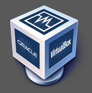
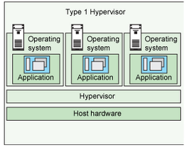
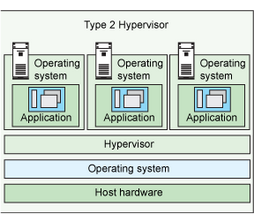
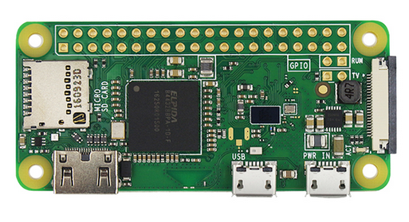
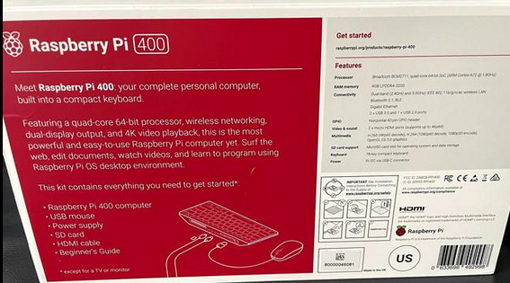
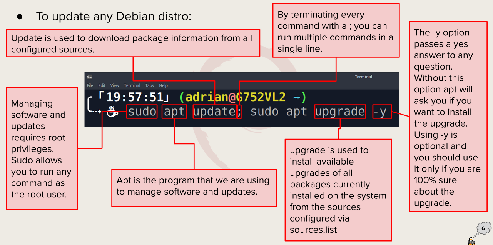
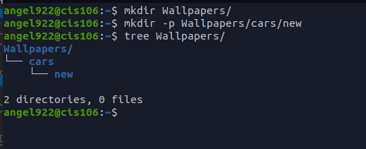

## What is Virtualization

Virtualization is the Replication of hardware to simulate a virtual machine inside a physical machine. 
### Types of Virtualization
* **Client side virtualization:** A client side virtualization is a virtual machine inside the users device. For a client client side virtualization the computer would need a hypervisor, capable CPU, enough ram, and enough storage to run the machine. 
* **server side virtualization:** A server side of virtualization divides a physical server into multiple virtual machines. Virtual Desktop Infrastructure(vdi)has a thin client,zero client and a thick client. Desktops laptops tabets and servers are all used for the server side of virtualization.
   
 ### Hypervisor
 A hypervisor is software that allows the management of virtual machines. It creates and runs any type of VM. Hypervisors come in two different types. One being that it runs on hardware and the other that runs on a Host Operating system.

 ### Types of hypervisor
  * Tier 1: The first type of hypervisor is one that runs on the hardware. It would interact directly with its CPU, memory and physical storage. The user can also can manage guest operating systems. An example of tier 1 is VMware ESX.
  * Tier 2: The second type of hypervisor is the one that runs on a Host operating system. Runs on an operating sytem similar to other computer programs. Some examples of tier 2 would be VMware Workstation,VirtualBox, VMware player.
   

## Raspberry Pi
The Raspberry pi is a low cost, credit card sized computer that plugs into any monitor and uses a standard keyboard and mouse. It is similar to a desktop computer. Just a portable one that you can carry around in your pocket.
### Different models of the raspberry pi
I will be using a Raspberry PI 4 for my final project. The Three Raspberry Pi's that i have presented below are the Pi4, Pi zero and the PI400.
 

## Installing Kali Linux in Raspberry PI
* Download the image from the official site.
* Flash the image with Etcher
* Insert the sd card into your PI and log onto Kali.
* Once you log in Now its time to customize Kali to the users liking.

### Updating Kali Linux/Ubunto

To update any Debian distro the user would have to update from the root. Thats where the sudo command comes to play. The next command would be apt which is a collection of tools used to install,update and remove packages on debian. The update command is used to download the latest software.
### Installing Software in Kali Linux
* Installing Command examples
  * `sudo apt install`
* Searching for software
  * `sudo apt search 'software name here'`
* Deleting software
  * `sudo apt remove + package name`
  *  Example:
     *  `sudo apt remove vlc` will remove the vlc package.
  * To remove and purge a package use:
  ```
  sudo apt remove vlc
  sudo apt purge vlc
  sudo apt autoremove
  ```
  

## Basic Linux commands
|Commands | what it does | Syntax | Example |
|---------|--------------|--------|---------|
|cd       |Used for changing the current working directory | cd +destination | cd /home/$USER/documents|
|Pwd      |used for displaying the current working directory |Home + user  | pwd  /home/user|
|ls       |used for displaying all the files inside a given directory | ls + command + file                     | ls -r directory/to/list|


### Navigating the filesystem
|Directory | Funcition |
|----------|-----------|
|Bin       |Essential Commands|
|dev       |Device files |
|etc       |System configuration files |
|home      |User home directories |
|media     | Mount point for removable media|
|opt       |Add on software package|
|proc      | Kernal information, process control, system hardware information|
|srv       | information relating to services that run on the system |
|usr       | software not essential for system operation |
|var       |dedicated to variable data, such as logs, databases, websites. files that persist from one boot to the next|


### Managing Files and directories
#### mkdir
* Description: Used for creating directories.
* Usage: `mkdir + option + new directory path`
* Create a directory in the present working directory
  * `mkdir Wallpaper`
* Create a parent directory and child directory
  * `mkdir Wallpaper/cars/new`
  <br>
#### Touch
* Description: Is used for creating files.
* Usage: `touch + new file`
* Create a file called list 
  * `touch list`
* Create several files
  * `touch list_of_cars.txt script.py names.csv`
 #### rm
 * Description: Used to remove files. To remove directories rm must be followed by -r.
 * Usage: rm + file to be removed.
 * remove a file 
    * `rm list`
 * to remove a directory 
    * `rm -r downloads/games`
 #### mv
* Description: Moves and renames directories.
* Usage: mv + source + destination
* To move a file from a directory to another using relative path
  * `mv Downloads/homeowrk.pdf documents/`
#### cp
* Description: Copies files/directories from a source to a destination.
* Usage: cp + files to copy + destination
* To copy a file 
  * `cp downloads/wallpapers.zip Pictures/`

