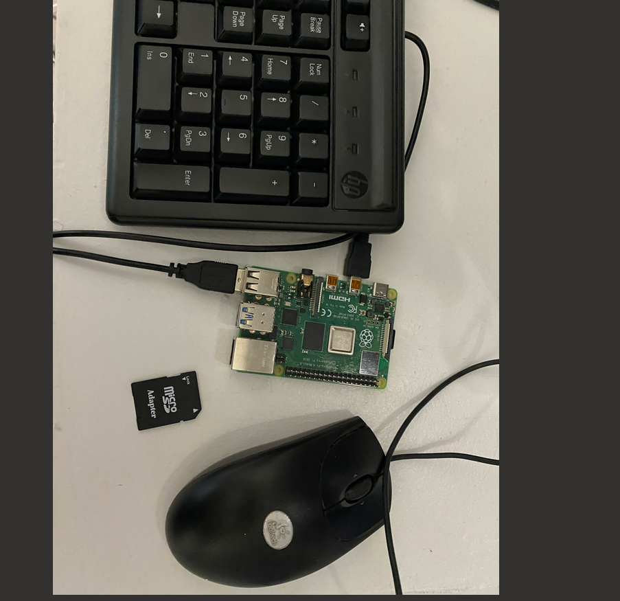
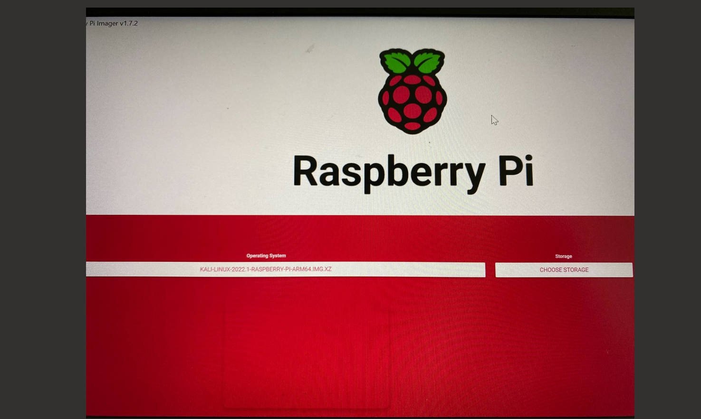
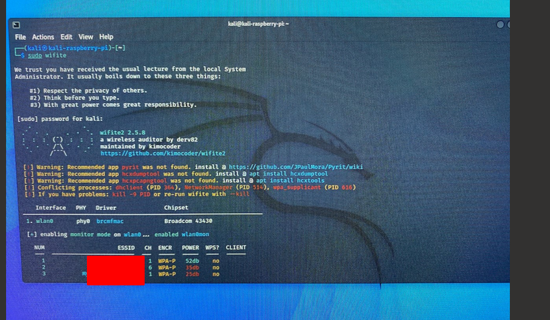
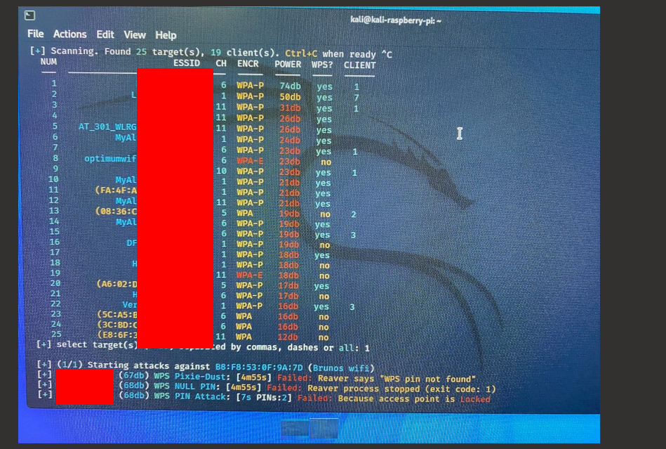
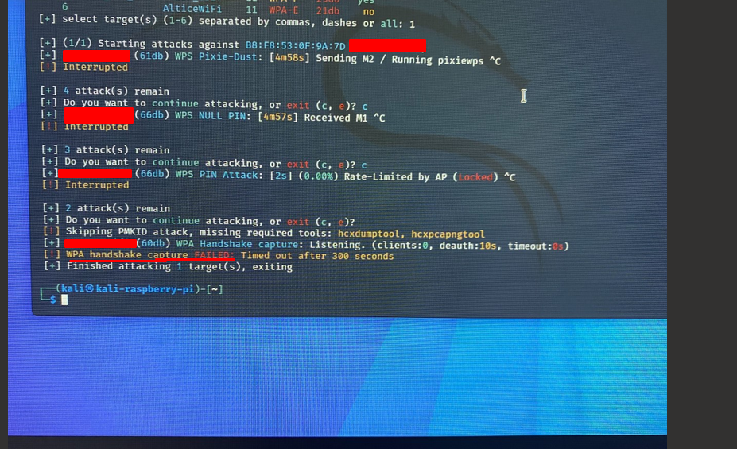

# Deliverable 3

## Portable Hacking Machine With Raspberry pi

### What is Needed for the attack
* A raspberry pi, mouse,keyboard is needed for the attack 
  
* Next you will need a laptop and a sd card to extract the kali software.
* Use raspberry pi imager to burn in into the sd card.
  
* Once this is all done you will need to insert the card into the Raspberry pi and it will boot up.
* Once it has booted up and you played around with it. It is time for the hacking to begin.
  
## Detail on the attack that will be demonstrated
* They are many ways to hack with kali linux. To Demonstrate the Attack i will be using Wifite which is used to hack wifi. 
* Fern,Reaver and wash are all very good wifi cracking tools.
* I've decided to use WIFITE because once you open the terminal Wifite will do all the hard work.
* The attack will be on my own person wifi network.
* We will see the Attack fail multiple times. It wont be able to crack my network because my pass word is too strong.
* Wifite will try and crack the network by providing multiple easy passwords.

### How Does It Work
* First we would have to open the terminal and type in 
  * `Sudo wifite`
  
* Once we do this it would scan all the wifi signals around us. We would then choose which one we want to attack.

* Since this is only for practice we should never attack anyone elses wifi except ours. 
* My wifi has a strong password so in this example i was not able to crack it.
  
* Here we would select which host we would like to attack and once you select which one you want to attack it would start to try to crack for the password.

### All the commands Involved
* In my example i used `ctrl c` to break the pixie-dust, NUll Pin, and also the WPS attack.
* The WPA handshake capture tried to crack my wifi network and as you can see here it failed because my password is to strong. 
* If anyone were to have a weak password (which plenty of people do) It would most likely be able to crack it.
  
