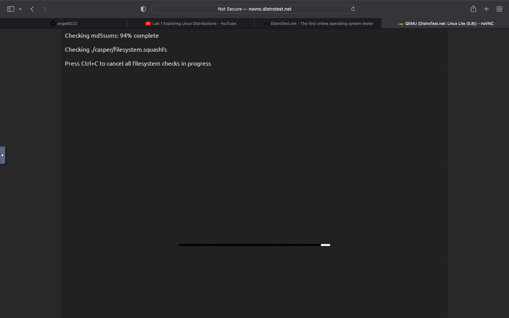
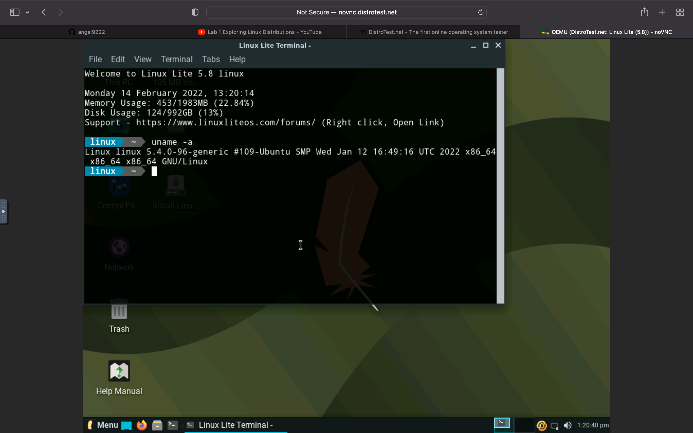

# Lab 1 Exploring Linux Distributions

## Question 1
1. What is the OS Type: **Linux**
2. Which major distro is it based on? **Debian**
3. Which processor architecture does it support? **armhf, ppc64el, riscv, s360x, x86_64**
4. Is the distribution active or is it discontinued? **The distribution is currently Active**
5. What is the distro’s home page? [Ubunto](https://www.ubuntu.com/)
## Question 2
1. What is the name of the distribution and the OS Type: **The distribution name is Ultimate Edition and the OS is Linux.**
2. Which major distro is it based on? **Debian, Ubunto.**
3. Which processor architecture does it support? **armhf, x86_64**
4. is the distribution active or is it discontinued? **The distribution is currently Active**
5. What is the distro’s home page? [Ultimate](http://ultimateedition.info/)
## Question 3
1. What is the name of the distribution?
**MXLinux**
2. What is the country of Origin?
**Greece**
3. What major distribution is it based on?
**Debian(stabel), antiX**
4. What is the distribution category?
**Desktop**
5. Which processor architecture, aside from the one in the original query, does the OS support?
**Aside from Debian(stable) the OS also supports antiX**
## Question 4
### A Linux distribution used for Data Rescue/Data recovery
| Distro name  | Website  | Desktop environment |
|--------------|----------|---------------------|
| **Kali LInux**       |  [Kali](http://www.kali.org/)             |  **Enlightenment, Xfce, Gnome**                   |
### A Linux distribution used for Education that supports the ix86 processor architecture.
| Distro name  | Website  | Desktop environment |
|--------------|----------|---------------------|
|  **NixOS**            | [NixOS](http://nixos.org/)         | **Awesome, IceWM, KDE Plasma**                    |
###  A Linux distribution that supports the OEM installation method
| Distro name  | Website  | Desktop environment |
|--------------|----------|---------------------|
| **Linux Mint**             |  [LinuxMint](https://linuxmint.com/)        |   **Cinnamon, MATE, Xfce**                  |
## Question 5 

## Question 6

