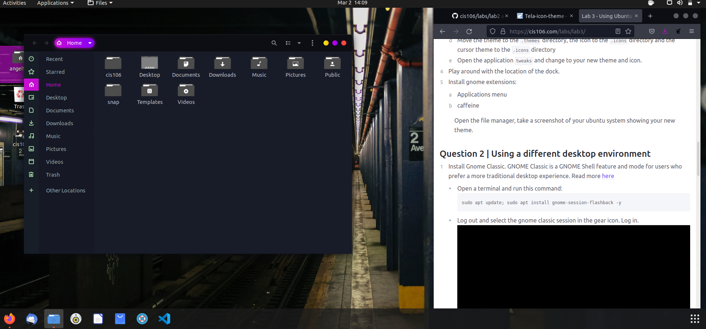

# Lab 3 using ubunto

# Question 1

# Question 2

# Question 3
| Program purpose     | Package Name | Version | Description |
| ------------------- | ------------ | ------- | ----------- |
| Play a tetris game  | quadrapassel |1:3.36.0-1|Tetris game             |
| Play a video file   | tellico-scripts | 3.2.3-1| video file            |
| Browse the internet | xfce4-appfinder |4.14.0-1|browse the internet            |
| Read your email     | thunderbird-dbg |1:91.5.0         |reading emails             |
| Play music          |xfce4-mpc-plugin    | 4.14.0 amd64        | Plays Music            |

commands Answers:
* Sub question 1: sudo apt intstall quadrapassel tellico-scripts xfce4-appfinder thunderbird-dbg xfce4-mpc-plugin
* Sub question 2: sudo apt remove quadrapassel tellico-scripts xfce4-appfinder thunderbird-dbg xfce4-mpc-plugin
 
# Question 4
| command | what it does |
|---------|--------------|
| echo    | display a line of text             |
| fortune |  print a random, hopefully interesting, adage |
| cowsay  |  configurable speaking/thinking cow (and a bit more)  |
| lolcat  | rainbow coloring for text|
| figlet  |   display large characters made up of ordinary screen characters           |
| toilet  | display large colourful character             |
| rig     | Random Identity Generator
             |