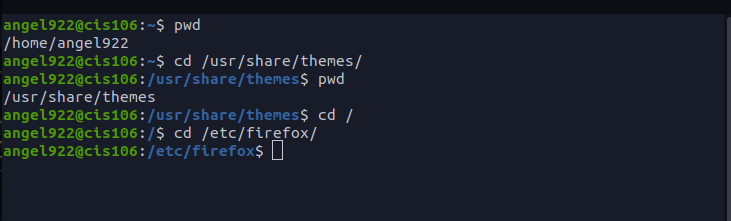
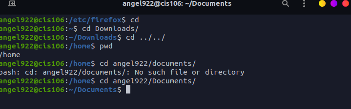
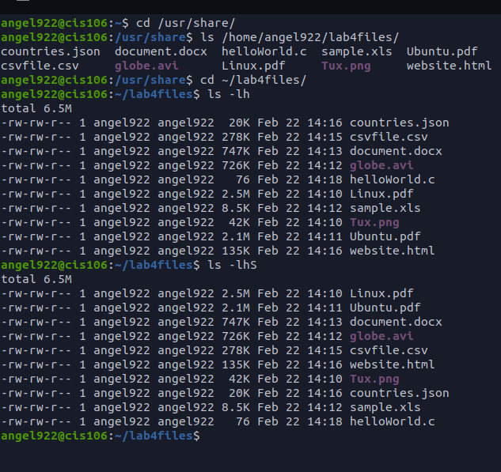
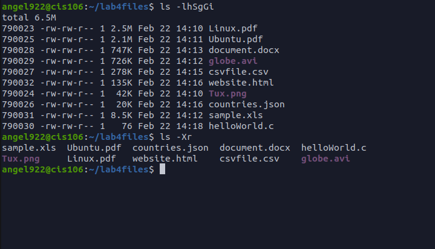
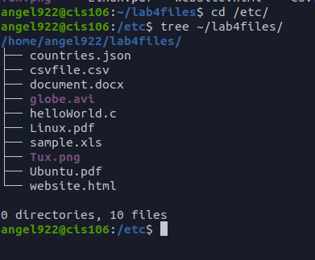
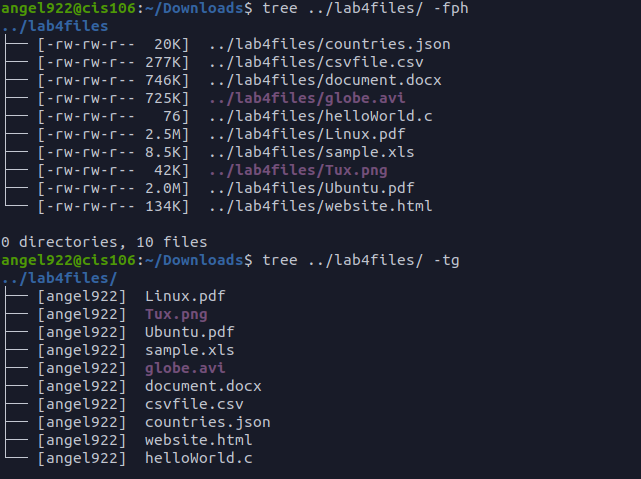
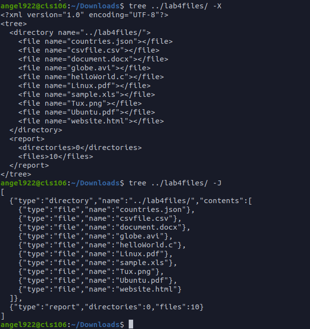
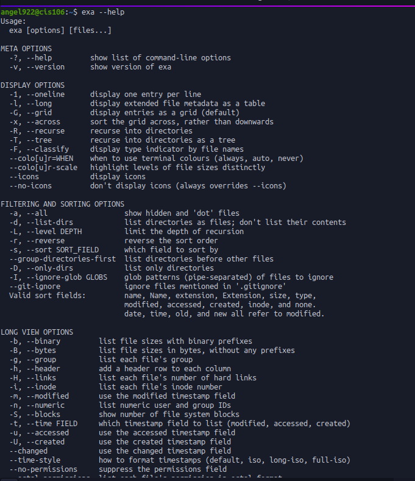
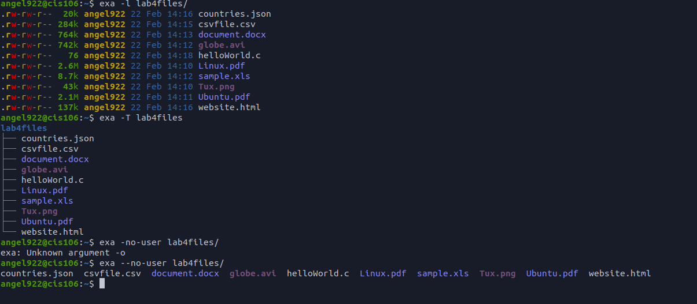

# Lab 4 The Linux filesystem

## Question 1

|Directory | Funcition |
|----------|-----------|
|Bin       |Essential Commands|
|dev       |Device files |
|etc       |System configuration files |
|home      |User home directories |
|media     | Mount point for removable media|
|opt       |Add on software package|
|proc      | Kernal information, process control, system hardware information|
|srv       | information relating to services that run on the system |
|usr       | software not essential for system operation |
|var       |dedicated to variable data, such as logs, databases, websites. files that persist from one boot to the next|

|Commands | what it does | Syntax | Example |
|---------|--------------|--------|---------|
|cd       |Used for changing the current working directory | cd +destination | cd /home/$USER/documents|
|Pwd      |used for displaying the current working directory |  | pwd  /home/user|
|ls       |used for displaying all the files inside a given directory | ls + command + file                     | ls -r directory/to/list|

## Question 2
 
 
## Question 3
 
 

## Question 4
 
 
 

## Question 5
 
 
