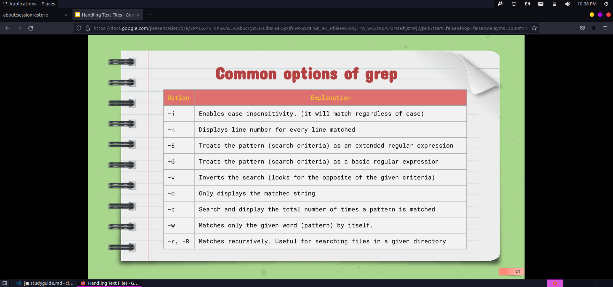

# Final Study Guide

# date
## Description
Displays the current date
## syntax
Date

# uname
## Description
Displays information about your system

# du
## Description
Information of the disk usage of files and directories of on the machine

# free
## Description
Displays amount of free memory
## syntax
free

# echo
## Description
outputs strings that are passed as arguments
## syntax
echo + "........"

# apt
## Description
Used for installing/removing and updating Debian Packages.
## syntax
Sudo + apt + install + package name
## Example
* To install several programs in a single command
  * `sudo apt install firefox flameshot caffeine -y`
* To install and remove in a single command
  * sudo apt install firefox+ flameshot- caffeine- vlc+

# pwd
## Description
Used for displaying the current working directory

## cd

## Description
Used for changing the current working directory. When no directory is given cd changed the current directory to the home directory
## syntax
cd + destination
## Example
* Brings you to home directory
  * `cd ~`
* go back or more directories
  * `cd ../`
* 

## ls
## Description
Used for displaying all the files inside a given directory. when no directory is specified, ls displays the files in the current directory.
## syntax
ls + files to list
## Example
* list all files and hidden files
  * `ls -a`
* list all files by size
  * `ls -S`
* to long list
  * `ls -lh`
## tree
## Description
display content of a directory ina tree- like format
## syntax
tree + command

## man
## Description
is a manuel in the terminal
## syntax
man + option

## mkdir
## Description
Used for creating a single directory or multiple directories
## syntax
mkdir + the name of the directory
## Example
* 
## touch
## Description
is used for creating files
## syntax
Touch + the file you want to create
## Example
* to create multiple files
  * `touch + the multiple files you want to create
* To create a file using absolute path
  * touch ~/Downloads/games.txt
* Create a file with a space in its name
  * Touch "list of foods.txt
## rm
## Description
Removes FIles
## syntax
rm + file you want to remove
rmdir to remove empty directories
rm -r + directory name for non empty directories.
## Example
* remove all files inside a directory and ask before removing more than 3 files
  * `rm -I Downloads/games/*
## cp
## Description
copies files from a source to a destination
## syntax
cp + files to copy + destination
## Example
* to copy the content of a directory to another directory
  * `cp downloads/wallpapers/* ~/pictures/
* to copy multiple files in a single command
  * `sudo cp -r`

## mv
## Description
Moves and renames directories
## syntax
mv + source + destination
## Example
* To move and rename a file in the same command
  * `mv ~/downloads/homework.docx ~/downloads/cis106homework.docx`
* renaming files
  * `mv + file/directory to rename + new name`
* to move using absolute path
  * `sudo mv`

## Wildcards (*,?,[])
## Description
Wildcard represents letters and characters used to specify a file name for searches. A star matches anything and nothing and matches any number of characters. The ? matches wuth one character. The [] matches with a single charcater in a range
## Example
* ls *.txt will match all the files that in in txt
* ls -1x *.?? will list all the files in a signle command. the * will match any file name the period is static as it is part of the file extension. the ?? indicates the file must have 2 characters.
* ls f[aeiou]*, ls *[0-9]

## Brace expansion
## Description
allows you to generate arbitrary strings to use with commands
## Example
* to create a N number of files 
  * `touch website{1..5}.html`
## cat
## Description
To display the content of a file.
## syntax
cat + option + file(s) to display
## Example
* display the content of a file with line numbers
  * `cat -n ~/documents/todo.md`
* file supressing repeating lines
  * `cat -s`
* excluding empty lines
  * `cat -b`
  

## head
## Description
Displays the top number of lines of a given file.
## syntax
head + option + file(s)
## Example
* display the first 10 lines
  * `head ~/documents/books
* display the first 5 lines
  * `head -5`
## tail
## Description
Displays the last number of lines given by a file
## syntax
tail + option + file
## Example
* last 10 line
  * `tail ~/documents/books
* last 5 lines
  * `tail -5`

## cut
## Description
Used to extract a specific section of each line of a file and display it to the screen.
## syntax
cut + option + file(s)
## Example
* display a list of users in your system
  * `cut -d ':' -f1
* changing the delimeter in the output
  * `cut -d ':' -f1,7 --output-delimiter=' => '`

## tr
## Description
## syntax
## Example

## paste
## Description
Used for joining files horizontally in columns
## syntax
paste + option + files
## Example
* merge two files using a diff delimiter
  * `paste -d":"

## wc
## Description
Used for printing the number of lines
## syntax
wc + option +file(s)
## Example
* display the number of characters in a file
  * `wc -m`
* number of lines
  * `wc -l`
* number of words
  * `wc -w`

## grep
## Description
used to search text in given file
## syntax
grep + option + search criteria +file(s)
## Example

## output redirection
## Description
Pipe allows you to redirect the standard output of a command to the standard input
## syntax
command 1 | command 2| command 3|
## Example
* man ls | grep "human-readable"
* head -2 file.lst |tail -1
* 
## Saving the output of a command

## syntax
command output + > +file
## Example
* `ls -lA ~ > all-files
  
## vim or nano (basic stuff: open a file, close a file, edit a file)
## Description
command line text editor. Using the e command will tell vim you want to edit a file. Vim has certain modes 
* insert mode for text
* normal mode for manipulating text
* command mode for enetering commands

## tar
## Description
creates archives by combines files and directories into one file
## syntax
tar + option + archive name + files to add to archive
## Example
* tar -cf files.tar file 1 file 2

## gz, bzip2, or xz
## Description
These commands are used for compression
## Example
* compress a single file 
  * `gzip file.txt`
  * `bzip2 file.txt`
## chmod 
## Description
change permissions on files and directories
## Example
* chmod u+x 
* chmod o-x
* chmod u=rwx