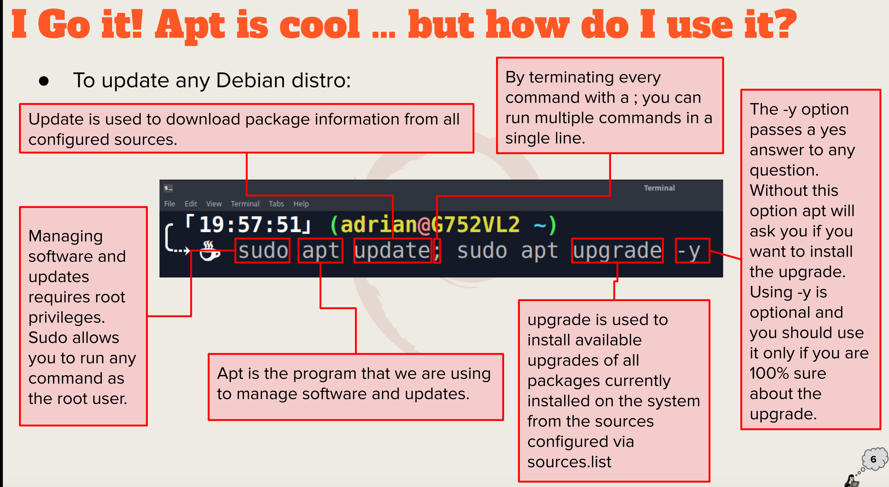

# Weekly Report 3
## Summary of Presentation
### Exploring Desktop Environments
* KDE Desktop Environment
* XFCE
* Mate Desktop Environment
* The Cinnamon Desktop Environment
* The LXQT Desktop Environment 

Gui: is a graphical user interface. It is a set of programs that allows a user to interact with the computer system.
DE: a desktop environment is an implementation of the desktop metaphor made of a bundle of programs running on top of a computers OS.
Some Common elements of a Desktop environment are 
* Favorites bar
* Launcher
* Menus
* Panels
* Widgets
### The Bash Shell
A shell is a layer of programming that understands and executes the commands a user enters.
* Tcsh shell
* Csh shell
* ksh shell
* zsh shell
* fish shell 
  Some Bash Shortcuts are 
* Ctrl + A: goes to the start of a command line
* Ctrl + F: moves ofward one character
* Ctrl + G: escape from history searching mode
* Ctrl + L: clears the screen
* ctrl + c: terminates the command
* !!: runs last command

Basic Commands
* Date - displays the date and time
* cal - shows the calender
* df - displays the amount of free space on disk drives
* free - shows amount of free memory.
### Managing Software
The command for updating ubunto is : Sudo apt update; sudo apt upgrade -y
Command to install software : Sudo apt install  'Package name'
Command to remove software: Sudo apt remove 'Package name'
Command for searching software: sudo apt search 'software name here'

a Package is a archive that contains binaries of software, configuration files,and information about dependencies.

Library: reusable code that can be used by more than one function or program

Repository: is a large collection of software available for download.

